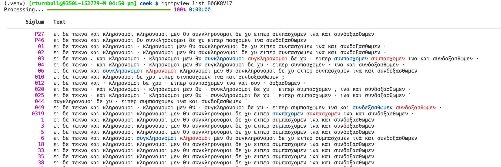

==============
igntpview
==============

Used for biblical TEI files from the INTF and the IGNTP.

Installation
============

Clone the repository and install the dependencies::

    git clone https://github.com/rbturnbull/igntpview.git
    cd igntpview
    poetry install

XML files
==========

Download XML files from https://itseeweb.cal.bham.ac.uk/epistulae/ or https://itseeweb.cal.bham.ac.uk/iohannes/transcriptions/index.html and place them in a directory.

Usage
=====

Enter the virtual environment with::

    poetry shell

Then use the program with::

    igntpview B06K8V17 --directory /path/to/xml/directory

Here B06K8V17 is the verse ID for Romans 8:17. I will make this more user-friendly if needed.

Example
=======

The blue text is original and text for correctors is in red.